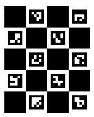

# Practical CV. *Illustrative Code Examples* for Springer book chapter [Computer Vision in Science: Deep Learning Algorithms and Practical Research Projects](link)

## Setup and Installation
Step-by-step instructions on how to deploy the project locally are described in each chapter folder (refer to README.md).

## Image Formation
Please navigate to [image_formation](./chapters/image_formation) folder for image formation code examples.

## Numesmatics
Please navigate to [numesmatics](./chapters/numesmatics) folder for coins grading code examples.

## Parkinson's Disease
Please navigate to [PD](./chapters/PD) folder for CV medical applications (neurological disorders) code examples.

## Web-camera Eye-tracking
Please navigate to [DL_gaze_estimation](./chapters/DL_gaze_estimation) folder for web-camera eye-tracking code examples.

## Summary
This practical, hands-on guide is ultimately intended to equip and inspire its audience to confidently conceptualize and execute innovative computer vision projects, thereby effectively translating cutting-edge algorithmic theory into tangible scientific discoveries.

