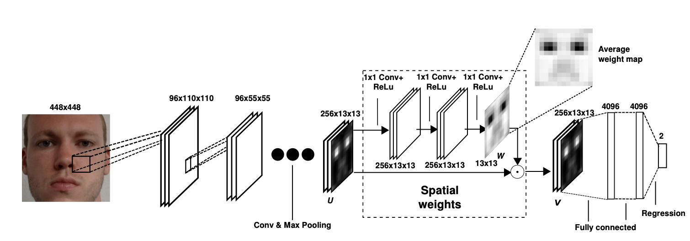

# Deep Learning Pipeline for Gaze Estimation

<table>
  <tr>
    
    <p style="text-align: center;">Full-Face, appearance-based gaze estimation network</p>
  </tr>
</table>

## Setup and Installation
Step-by-step instructions on how to deploy the project locally.

Please note that we have tested this code-base in the following environments:
* `Windows 11`
* `Python 3.9.25`
* `PyTorch 2.8.0`
* `pytorch-lightning 2.6.0`

### Requirements
For the following instructions it is assumed that `conda` (https://www.anaconda.com/download) is already installed on your PC.

Please install the following prerequisites by following the instructions found below:

```bash
conda env create -f environment.yml -n DL_gaze
conda activate DL_gaze
```

Please install the following prerequisites manually (as well as their dependencies), by following the instructions found below:
* PyTorch 2.8.0 - https://pytorch.org/get-started/previous-versions/

## Dataset
You need to download [MPIIFaceGaze](https://collaborative-ai.org/research/datasets/MPIIFaceGaze/) and [MPIIGaze](https://collaborative-ai.org/research/datasets/MPIIGaze/) from official websites as far as MPIIFaceGaze contains annotions from MPIIGaze. In our code example we provide small portion of original dataset (2 users).

## Data Preporcessing
```bash
cd ./src/utils
python preprocessing.py
```

For more details refer to [GazeHub@Phi-ai Lab](https://phi-ai.buaa.edu.cn/Gazehub/), website with gaze estimation methods from research group (PHI-AI Lab.) that is affiliated with the state key laboratory of virtual reality technology and systems, the school of computer science and engineering, Beihang University.

## Training, testing
For training run:
```bash
cd ./src
python train.py
```
It will put checkpoints in [checkpoints](./outputs/checkpoints) folder.

For testing run:
```bash
python test.py
```

## References
    @inproceedings{zhang15_cvpr,
        Author = {Xucong Zhang and Yusuke Sugano and Mario Fritz and Bulling, Andreas},
        Title = {Appearance-based Gaze Estimation in the Wild},
        Booktitle = {Proc. of the IEEE Conference on Computer Vision and Pattern Recognition (CVPR)},
        Year = {2015},
        Month = {June}
        Pages = {4511-4520} 
    }

    @inproceedings{zhang2017s,
      title={It’s written all over your face: Full-face appearance-based gaze estimation},
      author={Zhang, Xucong and Sugano, Yusuke and Fritz, Mario and Bulling, Andreas},
      booktitle={Computer Vision and Pattern Recognition Workshops (CVPRW), 2017 IEEE Conference on},
      pages={2299--2308},
      year={2017},
      organization={IEEE}
    }

    @article{Cheng2021Survey,
        title={Appearance-based Gaze Estimation With Deep Learning: A Review and Benchmark},
        author={Yihua Cheng and Haofei Wang and Yiwei Bao and Feng Lu},
        journal={IEEE Transactions on Pattern Analysis and Machine Intelligence (TPAMI)},
        year={2024}
    }