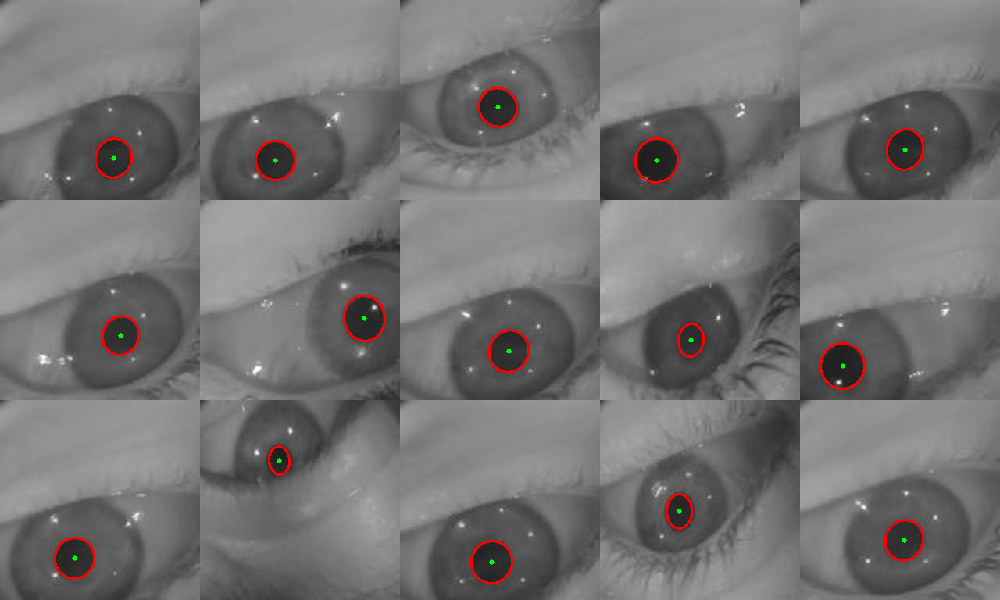

# Eye Segmentation and Time-Series Imaging for Neurological Disease Analysis
*A Deep Learning Pipeline for Pupil Segmentation, Feature Extraction, and TSI-based Classification*

## Abstract
This repository provides a complete deep-learning pipeline for near-infrared (NIR) eye-image segmentation, pupil geometry extraction, and time-series imaging (TSI)–based classification. The system integrates:
- U-Net and encoder–decoder segmentation architectures  
- CLANE preprocessing  
- Data augmentation  
- Pupil feature extraction (center, minor/major axes via ellipse fitting)  
- Conversion of pupil dynamics into TSI images (GASF, GADF, MTF, RP)  
- CNN-based classification  
- Leave-One-Subject-Out (LOSO) evaluation  

## Features
1. Eye Segmentation (U-Net, U-Net++, PSPNet, LinkNet, MAnet, FPN)  
2. Time-Series Imaging (GASF, GADF, MTF, RP)  
3. Pupil Post-processing and Ellipse Fitting  
4. Full Training and Inference Pipeline (dataset mode + single-image mode)  
5. Dataset Support: NN Human–Mouse Eyes, MMU Iris (inference-only)  

---

## Installation

```bash
conda create --name segmentationAndTSI_env python=3.10.0 -y
conda activate segmentationAndTSI_env
pip install -r pip_req_SegmentationAndTSI.txt
```

---

## Dataset Preparation

```bash
python "step 1.download_humanMouseData.py"
python "step 2.prepare_humanMouseData.py"
python "step 3.download_MMU_optional.py"
python "step 4.preparedata_MMU_optional.py"

# Optional: offline data augmentation
# (augmented samples will be stored on disk)
python data_augmentation.py
```

- The main NIR dataset (NN Human–Mouse Eyes) is stored under `data/NN_human_mouse_eyes/` after preparation.  
- The MMU Iris dataset is stored under `Data/MMU-Iris-Database/` and is used for **inference only** in `testAll.py` (no ground-truth masks are required).  

---

## Training

Example command:

```bash
python -u train.py     --DATASET_NAME NN_human_mouse_eyes     --MODEL_ARCH unet     --ENCODER_NAME resnet18     --W 256 --H 256     --batch_size 16     --num_epochs 2     --lr 0.001     --CLASSES_NUM 2     --N_SAMPLES 1     --USE_AUGMENTED 0
```

Here, `N_SAMPLES = 1` means **use 100% of the available data** for train/validation/test.  
A smaller value, e.g. `N_SAMPLES = 0.1`, will use only 10% of the samples in each split, which is useful for debugging.

### `train.py`: argument description

Below is a short explanation of each command-line parameter of `train.py`. fileciteturn1file1

| Argument | Type | Required | Description |
|----------|------|----------|-------------|
| `--DATASET_NAME` | `str` | Yes | Name of the dataset subfolder under `data/`. For example, `NN_human_mouse_eyes` expects images and masks under `data/NN_human_mouse_eyes/`. |
| `--MODEL_ARCH` | `str` | Yes | Segmentation architecture to use. Supported values include: `unet`, `UnetPlusPlus`, `PSPNet`, `Linknet`, `MAnet`, `FPN`. |
| `--ENCODER_NAME` | `str` | Yes | Encoder/backbone name used inside `segmentation_models_pytorch`. Examples: `resnet18`, `resnet34`, `mobilenet_v2`, `vgg11`, several `timm-mobilenetv3_*` variants, `mit_b0`. |
| `--W` | `int` | Yes | Target image width in pixels. All images and masks are resized to `(W, H)` before being passed to the network. |
| `--H` | `int` | Yes | Target image height in pixels. |
| `--batch_size` | `int` | Yes | Mini-batch size used by the `DataLoader` during training and validation. |
| `--num_epochs` | `int` | Yes | Number of training epochs. The script also tracks the **best validation loss** and saves the best checkpoint. |
| `--lr` | `float` | Yes | Learning rate for the Adam optimizer. |
| `--CLASSES_NUM` | `int` | Yes | Number of output classes. In this project the segmentation is binary (pupil vs background), so the model is instantiated with a single output channel. This argument is kept for potential multi-class extensions. |
| `--N_SAMPLES` | `float` | Yes | **Fraction** of samples to use from each split (`train`, `valid`, `test`). Values must be in `(0, 1]`. For example, `0.25` uses 25% of each split; `1` uses all samples. This is implemented by slicing the file lists after `get_images_masks_paths`. |
| `--USE_AUGMENTED` | `int` (0 or 1) | Yes | When set to `1`, the loader reads from files whose names contain the suffix `"_aug"` (offline-augmented data + original). When `0`, only original (non-augmented) images are used. This is passed as `sefics="_aug"` to `get_images_masks_paths`. |
| `--checkpoint_path_w` | `str` | No (default: `""`) | To be included. Optional path to a **weights-only** checkpoint. The current code includes commented logic for loading it; it can be used to initialize the model with pretrained weights if enabled. |
| `--checkpoint_path_full` | `str` | No (default: `""`) | To be included. Path to a folder containing a full training checkpoint (`checkpoint_full.pt` plus `train_loss_history.npy`, `val_loss_history.npy`). If non-empty, training **resumes** from that checkpoint (model weights, optimizer state, epoch index, and loss histories are restored). |

Additional internal behavior in `train.py`: fileciteturn1file1

- Results from each run are stored under `Results/ExpK_YYYY-MM-DD HH_MM_SS/`, where `K` is the experiment index.  
- The **best** model (lowest validation loss) is saved as `checkpoint.pth` in that folder.  
- Full training state is saved as `checkpoint_full.pt` in the same folder.  
- Loss curves are saved as `Loss.png`, and training/validation loss histories are stored as `train_loss_history.npy` and `val_loss_history.npy`.  
- At the end of training, the script evaluates the model on the test set and appends metrics to `final_results.csv` in the root directory.  

---

## Inference

### Dataset mode (default)

Example on the human NIR dataset:

```bash
python testAll.py     --mode dataset     --where2save ResultsInference/NN_human_mouse_eyes     --checkpoint_path Results/Exp3/checkpoint.pth     --W 256 --H 256     --DATASET_NAME NN_human_mouse_eyes     --MODEL_ARCH unet     --ENCODER_NAME resnet18     --N_SAMPLES 50     --USE_AUGMENTED 0     --threshold 0.5

python testAll.py   --mode dataset  --where2save results_mmu  --USE_AUGMENTED 0   --checkpoint_path Results/Exp3/checkpoint.pth  --W 256 --H 256 --MODEL_ARCH unet --ENCODER_NAME resnet18 --DATASET_NAME mmu --N_SAMPLES 5 --threshold 0.5

```

Here, `N_SAMPLES = 50` means: **evaluate only the first 50 images of the test split** (useful for quick testing). If you want to evaluate on the full test set, use the default (`-1`) or omit the argument.

### Single-image mode

```bash
python testAll.py     --mode single     --where2save output_single     --checkpoint_path Results/Exp3/checkpoint.pth     --W 256 --H 256     --MODEL_ARCH unet     --ENCODER_NAME resnet18     --image_path test_data/eye_example.png     --threshold 0.5
```

This runs the model on one image and saves:

- A binary mask (`*_mask.png`)  
- Pupil geometry (`*_features.txt`)  
- An overlay with the fitted ellipse (`*_overlay.png`)  

### `testAll.py`: argument description

`testAll.py` supports two main modes: `dataset` (evaluate a dataset) and `single` (process a single image). fileciteturn1file2

Common arguments:

| Argument | Type | Required | Description |
|----------|------|----------|-------------|
| `--where2save` | `str` | Yes | Output folder where metrics, images, masks, overlays, and summary CSVs are stored. Subfolders such as `images_org`, `images_CLANE`, `masks`, `prediction`, `ellipse_overlay`, `ellipse_features` are created automatically. |
| `--checkpoint_path` | `str` | Yes | Path to the **trained segmentation checkpoint** (e.g. `Results/Exp3/checkpoint.pth`). |
| `--W` | `int` | Yes | Target image width used during resizing before inference. Must match the training resolution. |
| `--H` | `int` | Yes | Target image height used during resizing before inference. |
| `--MODEL_ARCH` | `str` | Yes | Segmentation architecture name (must match the one used for training). |
| `--ENCODER_NAME` | `str` | Yes | Encoder/backbone name (must match the one used for training). |
| `--threshold` | `float` | No (default: `0.5`) | Threshold applied to the sigmoid output to obtain a binary mask (pupil vs background). |

Dataset-specific arguments (for `--mode dataset`):

| Argument | Type | Required | Description |
|----------|------|----------|-------------|
| `--DATASET_NAME` | `str` | No (default: `eye_ds`) | Name of the dataset to evaluate. Two behaviors: (1) If `DATASET_NAME` starts with `"mmu"` (case-insensitive), the script assumes the **MMU-Iris-Database** structure under `Data/MMU-Iris-Database/` and runs **inference only** (no ground-truth masks required, metrics are limited to runtime statistics). (2) For any other value, it loads images and masks from `data/{DATASET_NAME}` using `get_images_masks_paths` and computes full segmentation metrics. |
| `--N_SAMPLES` | `int` | No (default: `-1`) | Number of test images to process. If `N_SAMPLES > 0`, only the first `N_SAMPLES` images in the test set (or MMU image list) are evaluated. If `N_SAMPLES <= 0`, the entire test set is used. |
| `--USE_AUGMENTED` | `int` | No | Present for completeness, but in the current implementation the dataset branch explicitly sets `USE_AUGMENTED = 0` inside `run_dataset_mode`, so evaluation is performed on **non-augmented** images only. |

Single-image arguments (for `--mode single`):

| Argument | Type | Required | Description |
|----------|------|----------|-------------|
| `--mode` | `str` | Yes | Must be set to `single` for single-image inference. |
| `--image_path` | `str` | Yes (if `mode=single`) | Path to a single RGB eye image. The script will apply CLANE preprocessing, run segmentation, threshold the output, fit an ellipse to the predicted pupil, and save results in `where2save`. |

#### Behavior in `dataset` mode (non-MMU dataset)

- Loads test images and ground-truth masks using `get_images_masks_paths(root_dir=f"data/{DATASET_NAME}")`.  
- Applies CLANE preprocessing and resizes to `(W, H)`.  
- Runs the model and computes the following metrics (per image and averaged): IoU, F1-score, precision, sensitivity (recall), specificity, and accuracy.  
- Saves:  
  - Original images, CLANE images, masks, predictions (as PNGs)  
  - Combined panels (`ds_samples1.png`, `model1_results_output_3.png`, `model1_results_output_4.png`)  
  - Metrics in `metrics_test.csv`  
  - Optional updated ranking table `final_res_updated.csv` (based on `final_results.csv` created during training).  

#### Behavior in `dataset` mode (MMU Iris branch)

- Triggered when `DATASET_NAME` starts with `mmu` (e.g. `mmu`, `MMU`, `mmu_iris`, etc.).  
- Assumes images are stored under `Data/MMU-Iris-Database/subject_X/left/` and `.../right/` with standard image extensions.  
- No masks are used; **this is pure inference**:  
  - CLANE preprocessing  
  - Segmentation + thresholding  
  - Ellipse fitting and pupil-feature extraction  
- Saves a summary CSV `mmu_inference_summary.csv` containing the number of processed images and mean inference time per image.  

#### Behavior in `single` mode

- Loads a single eye image from `--image_path`.  
- Resizes and applies CLANE.  
- Runs segmentation and thresholding.  
- Fits an ellipse to the predicted mask and extracts:  
  - Pupil center (`x_center`, `y_center`)  
  - Minor axis (`dminor`)  
  - Major axis (`dmajor`)  
- Saves three files in `where2save`:  
  - `*_mask.png` — binary pupil mask  
  - `*_features.txt` — text file with geometric features  
  - `*_overlay.png` — original image with ellipse and center overlay  

---

## TSI Pipeline (High-level)

The repository is designed to support a complete pipeline in which:

1. U-Net-based segmentation produces pupil masks from NIR eye images.  
2. Post-processing extracts pupil center and ellipse geometry for each frame.  
3. These geometric features (e.g., pupil coordinates, major/minor axes) are assembled into time series.  
4. Time-series imaging (GASF, GADF, MTF, RP) converts 1D signals into 2D images.  
5. CNN-based classifiers operate on these images for tasks such as Parkinson’s disease vs healthy control vs PSP classification.  

(Example TSI code using `pyts` is shown in the chapter text; you can plug this segmentation output into that pipeline.)

---

## Results Summary


A sample experiment using U-Net with a ResNet-18 backbone (input size `256 × 256`) achieved:

| Metric      | Value |
|------------|-------|
| IoU        | 0.757 |
| F1-score   | 0.792 |
| Precision  | 0.780 |
| Recall     | 0.813 |
| Specificity| 0.998 |
| Accuracy   | 0.998 |

These numbers correspond to 5 epochs of training on the human subset of the NN Human–Mouse Eyes dataset.

---

## Citation

If you use this repository in academic work, please cite your thesis or article and optionally this codebase, for example:

```bibtex
@article{HAMMOUD2025120052,
    title = {Transfer learning for assessing Parkinson’s disease: Analysis of wrist-worn sensors data and time-series imaging},
    journal = {Measurement},
    pages = {120052},
    year = {2025},
    issn = {0263-2241},
    doi = {https://doi.org/10.1016/j.measurement.2025.120052},
    url = {https://www.sciencedirect.com/science/article/pii/S0263224125034116},
    author = {Mohammed Hammoud and Aleksei Shcherbak and Ekaterina Bril and Maksim Semenov and Oleg Sergiyenko and Andrey Somov},
    keywords = {Deep learning, Parkinson’s disease, Time-series imaging, Transfer learning, Wearable sensors}
}

@article{hammoud2023deep,
    title={Deep learning framework for neurological diseases diagnosis through near-infrared eye video and time series imaging algorithms},
    author={Hammoud, Mohammed and Kovalenko, Ekaterina and Somov, Andrey and Bril, Ekaterina and Baldycheva, Anna},
    journal={Internet of Things},
    volume={24},
    pages={100914},
    year={2023},
    publisher={Elsevier}
}

```

---


