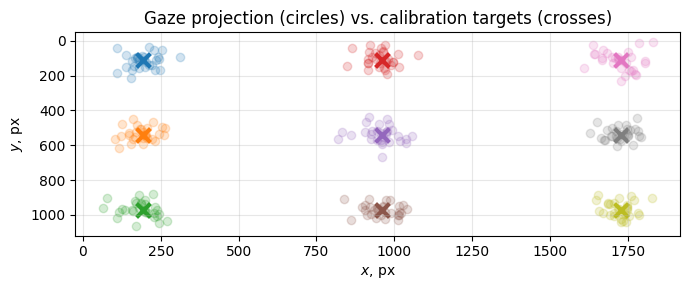

# Calibration for Gaze Estimation

<table>
  <tr>
    
    <p style="text-align: center;">Example of calibrated gaze estimation system</p>
  </tr>
</table>

## Setup and Installation
Step-by-step instructions on how to deploy the project locally.

Please note that we have tested this code-base in the following environments:
* `Windows 11`
* `Python 3.9.25`

### Requirements
For the following instructions it is assumed that `conda` (https://www.anaconda.com/download) is already installed on your PC.

Please install the following prerequisites by following the instructions found below:

```bash
conda env create -f environment.yml -n gaze_calib
conda activate gaze_calib
```

## Dataset
Code for gaze calibration is provided in Jupyter Notebook [gaze_calibration.ipynb](./gaze_calibration.ipynb).

## References
    @article{falch2024webcam,
      title={Webcam-based gaze estimation for computer screen interaction},
      author={Falch, Lucas and Lohan, Katrin Solveig},
      journal={Frontiers in Robotics and AI},
      volume={11},
      pages={1369566},
      year={2024},
      publisher={Frontiers Media SA}
    }