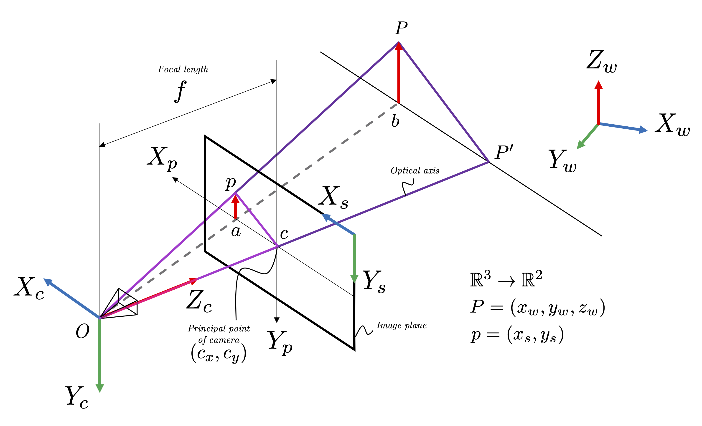

# Image Formation

<table>
  <tr>
    
    <p style="text-align: center;">Pinhole camera model</p>
  </tr>
</table>

## Setup and Installation
Step-by-step instructions on how to deploy the project locally.

Please note that we have tested this code-base in the following environments:
* `Windows 11`
* `Python 3.9.25`

### Requirements
For the following instructions it is assumed that `conda` (https://www.anaconda.com/download) is already installed on your PC.

Please install the following prerequisites by following the instructions found below:

```bash
conda env create -f environment.yml -n img_form
conda activate img_form
```

## Monocular Camera Calibration
Collect images with calibration pattern. The code is provided in [img_cap_for_calib.py](./src/img_cap_for_calib.py).

```bash
cd ./chapters/image_formation
python img_cap_for_calib.py
```

Calibrate the camera. The code is provided in [Zhang_calib.py](./src/Zhang_calib.py).

```bash
python Zhang_calib.py
```

## Distortion Correction
Perform distortion correction. The code is provided in [dist_corr.py](./src/dist_corr.py).

```bash
python dist_corr.py
```

## Projective Transformation
The code is provided in [project_trans.py](./src/project_trans.py).

## AR Toy Example
Verify projective transformation implemented in the previous subsection. The code is provided in [ArUco_AR.py](./src/ArUco_AR.py).

```bash
python ArUco_AR.py
```